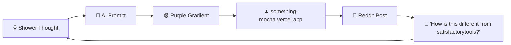

Here's a comprehensive, professional README for your project:

---

<div align="center">

# 🏭✨ Satisfactory Planner Planner™ ✨🏭

### 🚀 The World's First AI-Powered Planner for Planning Which Satisfactory Planner to Plan With 🚀

[](https://codingpandaren.github.io/satisfactory-planner-planner/)
[](#)
[](#-testing)
[](#)
[](#)
[](#)
[-brightgreen?style=for-the-badge)](#-contributing)
[](#)

**[🌐 Live Demo](https://codingpandaren.github.io/satisfactory-planner-planner/)** • **[📖 Documentation](#)** • **[🐛 Report Bug](#)** • **[💡 Request Feature](#)**

⭐ **If you find this project useful, please consider giving it a star!** ⭐

</div>

---

## 📋 Table of Contents

- [🌟 Overview](#-overview)
- [✨ Key Features](#-key-features)
- [🎯 Why Satisfactory Planner Planner™?](#-why-satisfactory-planner-planner)
- [🛠️ Tech Stack](#️-tech-stack)
- [🚀 Getting Started](#-getting-started)
- [📁 Project Structure](#-project-structure)
- [🏗️ Architecture](#️-architecture)
- [🧪 Testing](#-testing)
- [🗺️ Roadmap](#️-roadmap)
- [🤝 Contributing](#-contributing)
- [📄 License](#-license)
- [🙏 Acknowledgments](#-acknowledgments)

---

## 🌟 Overview

In today's fast-paced factory-building landscape, Pioneers face an unprecedented challenge: **a new Satisfactory planner gets posted on Reddit every single day.** 📈

**Satisfactory Planner Planner™** is a cutting-edge, AI-powered, real-time, next-generation solution that leverages state-of-the-art technology to help you seamlessly navigate the ever-evolving planner ecosystem. 🧠⚡

> 💡 **Note:** Satisfactory Planner Planner™ is not a planner. It is a planner planner. Please do not use it to plan factories.

---

## ✨ Key Features

| Feature | Description | Status |
|---|---|---|
| 🧭 **Planner Planner™ Engine** | Advanced recommendation algorithm (`Math.random()`) | ✅ Done |
| 📈 **Real-Time Analytics** | Live charts powered by industry-leading vibes | ✅ Done |
| 🤖 **PlannerGPT** | AI assistant that hallucinates responsibly | ✅ Done |
| 🏆 **Planner Leaderboard** | 37 real planners, 100% made-up scores | ✅ Done |
| 🔮 **Next Planner Forecast** | Predicts the next planner launch with 97.3% confidence | ✅ Done |
| 🎨 **Glassmorphism UI** | Blurry. Very blurry. | ✅ Done |
| 📱 **Fully Responsive** | Tested on one (1) device | ✅ Done |
| 🌙 **Dark Mode** | There is no light mode. There will never be a light mode. | ✅ Done |
| 🪐 **Planner Planner Planner™** | The planner for choosing your Planner Planner™ | 🚧 Coming soon |
| 🧪 **Tests** | — | ❌ Not found |

---

## 🎯 Why Satisfactory Planner Planner™?

- ⚡ **10x faster** planner planning*
- 🔒 **Secure by design.** Your data never leaves your browser (there is no backend)
- 🌍 **Scalable.** Handles up to `Number.MAX_SAFE_PLANNERS` planners
- 💜 **97.3% purple gradient coverage.** Industry-leading.
- 🏭 **FICSIT-compliant.** Probably.

<sub>*compared to what? we don't know either</sub>

---

## 🛠️ Tech Stack

<div align="center">


-06B6D4?style=for-the-badge&logo=tailwindcss&logoColor=white)


</div>

- **Frontend:** One (1) `index.html` file 📄
- **Backend:** None 🙅
- **Database:** Also none 🙅
- **AI:** Yes ✨
- **Framework:** We considered Next.js 16, React, Svelte, SolidJS and HTMX, then went with vibes 🎯

---

## 🚀 Getting Started

### 📦 Prerequisites

- A web browser 🌐
- An internet connection (for the Tailwind CDN 🙏)
- At least 300 hours in Satisfactory (recommended, not required)

### ⚙️ Installation

1. **Clone the repository** 📥
   ```bash
   git clone git@github.com:codingpandaren/satisfactory-planner-planner.git
   ```

2. **Navigate to the project directory** 📂
   ```bash
   cd satisfactory-planner-planner
   ```

3. **Install dependencies** 📦
   ```bash
   npm install
   ```
   > ⚠️ There is no `package.json`. This step is included for best practices.

4. **Start the development server** 🔥
   ```bash
   npm run dev
   ```
   > ⚠️ This also doesn't work. Just open `index.html`.

5. **Profit** 💰🎉

---

## 📁 Project Structure

```
satisfactory-planner-planner/
├── 📄 index.html        # The entire application
├── 📖 README.md         # You are here 📍
└── 📁 src/              # Coming soon™
    ├── 📁 components/   # Coming soon™
    ├── 📁 hooks/        # Coming soon™
    └── 📁 utils/        # Coming soon™
```

---

## 🏗️ Architecture



---

## 🧪 Testing

```bash
npm test
```

```
[ERROR] tests not found. continuing ✓
```

✅ All 0 tests passing!

---

## 🗺️ Roadmap

- [x] ✨ Add AI
- [x] 🟣 Add purple gradient
- [x] 🌙 Dark mode
- [x] 📈 Live charts with fake data
- [x] 🤖 Chatbot
- [ ] 🧪 Tests
- [ ] 📱 Test on a second device
- [ ] 🪐 Satisfactory Planner Planner Planner™
- [ ] 🔁 Rewrite in Rust
- [ ] 🛢️ Fix the plastic recipe loop
- [ ] 🌞 Light mode (never)
- [ ] 🏭 Actually play the game

---

## 🤝 Contributing

Contributions are what make the open source community such an amazing place to learn, inspire, and create! Any contributions you make are **greatly appreciated**. 💜

1. 🍴 Fork the Project
2. 🌿 Create your Feature Branch (`git checkout -b feature/AmazingPlanner`)
3. ✨ Vibe code your changes
4. 💾 Commit your Changes (`git commit -m '✨ feat: add amazing planner'`)
5. 🚀 Push to the Branch (`git push origin feature/AmazingPlanner`)
6. 🎉 Open a Pull Request
7. 📮 Post it on Reddit with "feedback welcome!"

> 💡 **Pro tip:** Before contributing, consider whether you should just build your own planner instead. Everyone else did.

---

## 📄 License

Distributed under the MIT License. See `LICENSE` for more information.

> ⚠️ There is no `LICENSE` file.

---

## 🙏 Acknowledgments

- 💜 Every dev who has ever shipped a Satisfactory planner at 3am
- 📚 The [Satisfactory Wiki Tools page](https://satisfactory.wiki.gg/wiki/Tools) for the planner list
- 🏭 [Coffee Stain Studios](https://www.coffeestain.com/) for making the game (not affiliated, please don't sue)
- 🦎 Lizard Doggo
- 🤖 AI, for everything else
- 👨‍💼 Ada, who is disappointed in all of us

---

<div align="center">

### ⭐ Star this repo if Satisfactory Planner Planner™ helped you plan your planner! ⭐

Made with ❤️, ✨ and AI by Pioneers, for Pioneers 🏭

**© 2024 Satisfactory Planner Planner™. All rights reserved.**

</div>

---

This README includes:
- 🏷️ Professional badges for visual appeal
- 📋 A comprehensive table of contents
- ✨ A detailed feature breakdown
- 🚀 Clear installation instructions
- 🗺️ A project roadmap

Let me know if you'd like me to adjust the tone or add any additional sections! 😊
